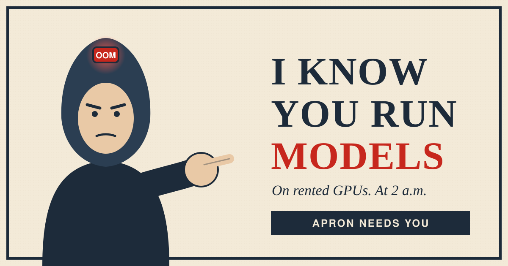

# I know you run models

<!-- Header image: the SVG is a placeholder sketch. The prompt for the final
image (what it must show so it reads as a real poster and carries the joke)
is img/i-know-you-run-models.prompt.md. -->

<!-- Draft. The tables between findings markers are generated by
scripts/cohort_findings.py from the stored records, cohort/modern-models.json
and the GPU-free predictions, and checked by tests/unit/test_cohort_findings.py;
never edit them by hand. The prose is updated here as each group of runs
lands; the owner rewrites it. This post stays `draft: true` until the owner
publishes it. The first cohort's post (phase-1b-cohort-findings.md) stays as
it is. Header image: a parody of the 1917 pointing poster (an engineer in a
hoodie, an "OOM" light instead of a hat), pending the owner's approval. -->

**On rented GPUs. At 2 a.m.**

You downloaded 60 GB, rented an H100, started vLLM, and got `out of memory`.
Or it booted and the model answered in its own thoughts until it ran out of
tokens. We have been there too: six times on purpose, and a few more times
by accident. So we measured it.

Apron answers three questions about an open model on a GPU: will it fit,
will it boot, will it answer. The first answer comes before you rent
anything. The other two come from one real boot, with the numbers written
down. If the boot fails, Apron reads the error, changes the plan and boots
again. This post runs it on the open models people run today.

<!-- STATUS: runs in progress. Every "not run yet" row below is filled by the
generator when its run lands. The model list is being checked against what
people actually use (not only download counts) and may change. -->

<!-- findings:headline -->
- Models measured: 14 on 6 GPU types
- Failure classes fixed and re-verified: 6 of 6
- Total cost: $11.37 of the $500 cap (failed boots included: $5.09)
<!-- /findings:headline -->

<!-- more -->

## Before you rent anything

Twelve models in four groups: one GPU with ordinary attention (A); one GPU
with a newer kind of attention (B); two to four GPUs (C); eight GPUs (D).
"Before any GPU" is what Apron says from the model's files alone: the
config and the tensor headers on the Hub. No weights are downloaded and no
GPU is rented for it.

<!-- findings:modern_models -->
| Group | Model | Size (B params) | Downloads / 30 days | GPU | Before any GPU | Status | Weights GiB: predicted / measured | Questions answered | Cost $ | Records |
|---|---|---|---|---|---|---|---|---|---|---|
| A | openai/gpt-oss-20b | 20.9 | 6,759,761 | NVIDIA GeForce RTX 4090 x1 | fits: 15.15 GiB per GPU | not run yet | — | — | — | — |
| A | openai/gpt-oss-120b | 116.8 | 4,484,728 | NVIDIA H100 80GB HBM3 x1 | fits: 63.18 GiB per GPU | not run yet | — | — | — | — |
| A | zai-org/GLM-4.7-Flash | 31.2 | 1,854,281 | NVIDIA H100 80GB HBM3 x1 | fits: 60.15 GiB per GPU | not run yet | — | — | — | — |
| A | google/gemma-4-31B-it | 31.3 | 9,460,570 | NVIDIA H100 80GB HBM3 x1 | fits: 64.65 GiB per GPU | not run yet | — | — | — | — |
| B | Qwen/Qwen3.8-27B | 27.8 | 6,727,629 | NVIDIA H100 80GB HBM3 x1 | fits: 56.82 GiB per GPU | not run yet | — | — | — | — |
| B | Qwen/Qwen3.6-35B-A3B-FP8 | 36 | 7,638,786 | NVIDIA H100 80GB HBM3 x1 | fits: 37.67 GiB per GPU | not run yet | — | — | — | — |
| B | nvidia/NVIDIA-Nemotron-3-Nano-30B-A3B-NVFP4 | 18.2 | 1,048,456 | NVIDIA H100 80GB HBM3 x1 | fits: 20.38 GiB per GPU | not run yet | — | — | — | — |
| C | MiniMaxAI/MiniMax-M2.7 | 228.7 | 1,191,260 | NVIDIA H200 x2 | fits: 109.67 GiB per GPU | not run yet | — | — | — | — |
| C | deepseek-ai/DeepSeek-V4-Flash-0731 | 304.2 | 3,959,727 | NVIDIA H200 x4 | fits: 40.72 GiB per GPU | not run yet | — | — | — | — |
| D | zai-org/GLM-5.3 | 753.3 | 1,351,716 | NVIDIA H200 x8 | fits: 90.11 GiB per GPU | not run yet | — | — | — | — |
| D | deepseek-ai/DeepSeek-V3.2 | 685.4 | 2,979,489 | NVIDIA H200 x8 | fits: 82.28 GiB per GPU | not run yet | — | — | — | — |
| D | moonshotai/Kimi-K2-Instruct-0905 | 1026.5 | 60,539 | NVIDIA B200 x8 | fits: 122.07 GiB per GPU | not run yet | — | — | — | — |
<!-- /findings:modern_models -->

**Some of these models are not built like last year's.** Qwen 3.6 and 3.8,
and Nemotron 3, mix ordinary attention with layers that keep a fixed-size
state (linear attention, or Mamba). Gemma 4 mixes short-window and full
attention with different head sizes, and keeps its text model inside a
multimodal config. vLLM reserves memory for these layers in its own way.
Apron first said "unknown" rather than guess. Its very first answer for
Nemotron 3 had been a confident, wrong number. We traced how vLLM counts
these layers in its source. Apron now reproduces that count to the byte
for all four. A boot still has to confirm it.

**One thing to know before you rent an 80 GB card for Gemma 4-31B:** at
vLLM's default context (262,144 tokens) it needs at least 33 GiB of cache
next to ~58 GiB of weights, so it will not start. Ask for the context your
workload needs; Apron plans it that way.

**Checking before paying found three mistakes of ours.** No GPU was rented
to find them. Each is fixed and written down in the run notebook:

- a model split across several GPUs was sized as if it sat on one;
- hybrid models got an estimate for ordinary attention;
- the check that asks "would vLLM load these tensors?" refused every large
  mixture-of-experts model, because it did not know tensors the model owns
  itself, such as the expert router's bias. Now it refuses a tensor only
  when vLLM's source names it nowhere. It still catches what it was built
  for: FPQuant checkpoints that no vLLM since 0.23 can load.

<!-- TODO when group A lands: predicted vs measured per model, one line each;
the startup peak; the answers. -->

## Don't pay a GPU to download

A 700 GB model downloaded on eight H200s ($37 an hour) costs money before
anything runs. So Apron downloads first. A CPU pod in the same datacenter
puts the weights on a network volume and checks every file. Then the GPU
pod attaches that volume and only loads. The first CPU pod in a US
datacenter pulled Gemma 4-31B's 62.6 GB in 133 seconds. Here is where each
GPU pod's time went:

<!-- findings:weights_time -->
_No boot from staged weights yet._
<!-- /findings:weights_time -->

<!-- TODO: compare with the same model's boot that downloaded on the GPU pod.
Region matters (owner's experience: US fast, Europe slower, Asia slowest);
every staging event records its datacenter. -->

## When it broke anyway

Six deliberately broken plans, one per kind of failure, from our first
round. Apron fixed each one and asked the same questions again. New
failures on these models land here as they happen.

<!-- findings:fixes -->
| Failure | Broken plan | vLLM error from | What Apron changed | Fixed plan booted | Tasks passed | SLO passed | Result | Record |
|---|---|---|---|---|---|---|---|---|
| 1. Weights do not fit the GPU | Qwen/Qwen3-14B on NVIDIA GeForce RTX 4090 | `model_executor/layers/linear.py:192` | GPU: NVIDIA GeForce RTX 4090 → NVIDIA RTX A6000 | yes | yes | yes | Fixed | `1220f4b5d596eaa3` |
| 2. No room for the KV cache | Qwen/Qwen3-8B on NVIDIA GeForce RTX 4090 | `v1/core/kv_cache_utils.py:879` | max_model_len: 40960 → 32640 | yes | yes | yes | Fixed | `1220e8f6ea8e7da0` |
| 3. Context length above the model's limit | mistralai/Mistral-7B-Instruct-v0.3 on NVIDIA GeForce RTX 4090 | `config/model.py:2502` | max_model_len: 999999 → 32768 | yes | yes | yes | Fixed | `12207f1e236c341a` |
| 4. float16 not supported by the model | google/gemma-2-2b-it on NVIDIA GeForce RTX 4090 | `config/model.py:2262` | dtype: float16 → bfloat16 | yes | yes | yes | Fixed | `122038df2ccafa66` |
| 5. Tensor parallelism does not divide the heads | Qwen/Qwen3-8B on NVIDIA A100-SXM4-80GB | `config/model.py:1414` | tensor parallel: 3 → 2 | yes | yes | yes | Fixed | `12208faa3f0af819` |
| 6. Quantization needs a newer GPU | ISTA-DASLab/Qwen3-8B-FPQuant-RTN-MXFP4 on NVIDIA H100 80GB HBM3 | `config/vllm.py:791` | model: ISTA-DASLab/Qwen3-8B-FPQuant-RTN-MXFP4 → Qwen/Qwen3-8B-AWQ | yes | yes | yes | Fixed | `12201e071813c808` |
<!-- /findings:fixes -->

## The bill

Everything counts: failed boots, retries, the CPU pods that download
weights, and the storage they download to.

<!-- findings:failed_spend -->
| Why the boot failed | Boots | Cost $ | Records |
|---|---|---|---|
| a broken plan, failing as its class names (on purpose) | 6 | 1.5023 | `122003cbc66ff472`, `1220233b18004d3c`, `1220736506a57c47`, `122082b8cebddc87`, `12209c87b885bbbd`, `1220e27e21b0a24a` |
| a fix that did not work | 1 | 1.3929 | `1220e2bb9d9e3077` |
| an earlier broken plan, since replaced | 2 | 0.9162 | `12202f6bb9980912`, `12206934f05d6002` |
| the harness: a full disk cut the download short (a tokenizer error) (classified from the log) | 2 | 0.7782 | `122076c27e44225e`, `1220efb427f64eff` |
| the harness: engine still starting when the harness gave up (classified from the log) | 1 | 0.3595 | `1220348ef02b049d` |
| the harness: compiler missing from the engine's environment (classified from the log) | 1 | 0.1332 | `1220c680fcc992dd` |
| the harness: download check flagged a complete file | 2 | 0.0041 | `1220c29b41840303`, `1220c4ab40df7487` |
| the harness: GPU provider API error | 2 | 0.0003 | `122016a268314541`, `1220763a9b91627f` |
<!-- /findings:failed_spend -->

## The fine print

- One provider (RunPod, Secure cloud). One measurement per point unless a
  table says otherwise.
- The answer check is three short questions scored by exact match: it
  shows whether a model answers at all, not how good it is. Reasoning
  models get 512 tokens and have their thinking switched off where they
  allow it.
- The GPU is whatever a datacenter that can hold the weights has in stock,
  so a model may run on a different GPU than proposed. The table shows the
  one it actually ran on.
- The H200's memory size in Apron's table is not yet confirmed on a pod.

## Apron needs YOU

Apron is not something you can install and run yourself yet. What it has
is the records, and they grow with every run. Tell us which model on which
GPU it should check next, and it gets checked:
[GitHub Discussions](https://github.com/mondegreens/apron/discussions).
