# I know you run models. Will it boot?

<!-- Draft for the owner. Every number below comes from a stored record in
_dev_notes/cohort-run/records (digests in "Where the numbers come from") or
from the pinned vLLM source (file:line). -->

I know you run models. A new one comes out, everyone on your timeline is
running it, and you rent an H100 to try. Forty minutes and a few dollars later
you still do not know whether it fits on that card, and if it does, with what
flags.

So I ran them: twelve of the open models people run this month, from one RTX
4090 to four H200s, and I kept every boot, every failure and every bill, so
you do not have to pay to find out.

This post is what I learned, and the tool that did it: Apron, an open-source
tool that answers "will it fit, will it boot, will it answer" before you rent
the GPU, then checks its own answer on a real one and keeps both. It is also
about what I got wrong along the way, and how I found out.

## Highlights

- **Before renting anything**, Apron predicted the memory of current open
  models (gpt-oss-120b, gpt-oss-20b, GLM-4.7-Flash, Gemma 4 31B,
  Qwen3.6-35B-A3B, Muse-Glimmer-30B, Nemotron-3.5, Qwen3.8-27B, GLM-5.3-Flash,
  Qwen3.8-Flash-Next, DeepSeek-V4-Flash, DeepSeek-V4.1-Flash) from their
  configs, safetensors headers and the pinned vLLM release's own source.
  Weights landed within 1.5% of what vLLM measured on the GPU, with two
  exceptions the source explained: gpt-oss-20b on an RTX 4090 came out 7.7%
  heavier because vLLM pads its experts on that card (Apron counts it now),
  and Qwen3.8-Flash-Next 3.5% heavier, half of it layers vLLM keeps whole on
  every GPU (counted now) and half not explained yet.
- **It was wrong about the startup memory peak** of four new models (off by up
  to 3×). I did not tune a constant. I recorded the GPU allocator's history
  during vLLM's profiling run, found every live tensor at the peak, and fixed the
  rule for all models. Today all 30 measured points in the records agree within
  10%, 27 within 6%. The four-GPU models vLLM runs uncompiled are still off,
  and kept apart until they are explained.
- **Two models failed to boot** with vLLM's defaults on an H100, both hybrid
  (Mamba / linear attention) models. Both failures are predictable without a
  GPU, and the planner now chooses a setting that avoids them. With it, both
  booted and answered 3/3.
- **One model booted and "failed" every task while answering all of them
  correctly.** It needed a reasoning parser. Booting is not answering.
- **GLM-5.3-Flash on four H200s runs, but only in eager mode.** With CUDA
  graphs vLLM's own DEBUG-only check caught the graphs reading moved inputs on
  a tool call. That check exists so a model does not answer wrong in silence.
- **The four-GPU group booted.** Qwen3.8-Flash-Next, DeepSeek-V4-Flash and
  DeepSeek-V4.1-Flash on four H200s answered every deployment check; only
  DeepSeek-V4.1-Flash also met the 2 s time-to-first-token target.
- **vLLM released v0.30 on September 22.** Apron planned on it the same week:
  one runner image per vLLM version, facts and diagnosis rules generated from
  that version's source. Two of the models I ran, GLM-5.3-Flash and
  DeepSeek-V4.1-Flash, do not load on v0.29 at all.
- **All of it cost $170.86**, including every failed boot, every diagnostic
  run, and one pod I kept to debug by hand that billed $21.57 on its own.

## The problem nobody owns

Deploying an open model on your own GPU is a three-way bet: the checkpoint, the
engine version and the hardware. Each of the three moves.

- **The engine.** vLLM ships a release every two weeks; v0.24 came out on
  June 29 and v0.30 on September 22. Its maintainers are candid about how fast
  things change: they dropped a hand-maintained model capability table because
  it "drifts", and they now run nightly accuracy and performance checks on the
  datacenter recipes they care most about.
- **The models.** New attention layouts arrive about monthly: Mamba and gated
  delta-net hybrids, DeepSeek V4's compressed KV cache, GLM-5's linear plus
  sparse attention. Each one pages memory differently. "Day-0 support" is the
  most common kind of post on the vLLM blog.
- **The hardware.** Consumer, professional and datacenter cards, rented by the
  hour, with memory that is never quite the number on the box. An H100 80GB
  gives PyTorch 85,017,493,504 bytes, not 85,899,345,920.

The tools around this are good and getting better. vLLM refuses many bad
configurations before loading and tells you what to change. NVIDIA's
aiconfigurator and llm-d's planner estimate memory and performance for common
attention types; aiconfigurator now lists hybrid models too. Hugging Face shows
whether GGUF and MLX files fit your hardware. None of them gives the joined
answer I kept needing: this exact checkpoint, on this exact vLLM version, on
this exact GPU, predicted before paying and then checked.

That need is on record. vLLM issue
[#29325](https://github.com/vllm-project/vllm/issues/29325) asked for a
preflight "dry run". In the discussion, a contributor from llm-d proposed
building such a planner outside vLLM and tracking the vLLM version, "since
version differences constantly affect performance and deployment". The issue
was closed as not planned in July. The planners say it themselves: aiconfigurator's README still
notes that memory estimation "needs to be studied more", and one of its issues
([#1396](https://github.com/ai-dynamo/aiconfigurator/issues/1396)) documents a
sweep that skipped the KV budget check, over-predicted throughput 4.6× and
recommended a configuration that did not deploy. That is not a knock on them.
It is what every estimate looks like until it is checked against a boot.

## What Apron does

Apron is a small loop with a strict rule about what it is allowed to call true.

1. **Plan, GPU-free.** Read the checkpoint's config and safetensors headers from
   the Hub (headers only, no weights), and the facts of the pinned vLLM version:
   which architectures it registers, which tensors it loads and which it skips,
   how it pages KV cache for each layer type, its default batch sizes. Compute
   weights, KV cache per sequence, the startup activation peak and the CUDA
   graph cost per GPU.
2. **Say "unknown" out loud.** If a model uses an attention layout the
   calculator does not model, the answer is "unknown", not an estimate borrowed
   from a different layout.
3. **Boot and measure.** Rent the GPU, download the weights on the pod, boot the
   exact plan, read vLLM's own memory accounting, run a small task suite and a
   serving benchmark, tear the pod down.
4. **Keep prediction beside measurement.** Every record is content-addressed
   and stores what was predicted next to what was measured, with the engine
   image digest and the hardware it ran on.
5. **Prove fixes.** When a boot fails, the error is fingerprinted and matched to
   a correction rule. A rule starts as a *hypothesis*; it becomes a proven rule
   only when a second boot with the correction succeeds.

Every number Apron shows is labelled by how it is known: *derived* (computed
from inputs), *proven constraint* (the pinned engine's source enforces it),
*predicted* (the calculator modelled it) or *measured* (the exact execution
observed it). A prediction is never presented as a vLLM test.

## The models, one card each

I picked models by what people actually use and talk about in September 2026
(OpenRouter rankings, provider counts, Hacker News and r/LocalLLaMA threads),
not by download counts. Each card answers what you would ask before deploying
it yourself: what hardware, does it fit, how much room is left for the KV cache,
how long a cold start takes, how fast the first token comes back, and what you
have to set or it breaks.

Two caveats that apply to every card. These boots used `--max-model-len 640`
(short test prompts), so the KV room is shown as the size of the token pool
vLLM allocated, which does not depend on that limit for these models; the
number of concurrent long-context requests it supports is the pool divided by
your context length. And "cold start" is a first boot on a fresh pod,
including `torch.compile`; a warm compile cache is faster.

### Run this week

**gpt-oss-120b** (OpenAI; MoE, alternating sliding and full attention; vLLM v0.29)
- Hardware: one H100 80GB. Weights predicted 60.77 GiB, measured 61.43 GiB.
- KV room: 5.7 GiB, a pool of 81,951 tokens.
- Cold start: 227 s. Time to first token, p99: 2.29 s, which misses a 2 s SLO
  at this concurrency; everything else passed, tasks 3/3.
- Needs: `reasoning_effort: low` in the request to keep answers short.

**GLM-4.7-Flash** (Z.ai, previous generation; MoE, multi-head latent attention; v0.29)
- Hardware: one H100. Weights predicted 55.77 GiB, measured 55.87 GiB (after
  I stopped counting the multi-token-prediction layer vLLM does not load).
- KV room: 8.5 GiB, 169,216 tokens; MLA's compressed cache is why so many
  tokens fit in so little memory.
- Cold start: 104 s. p99 TTFT 1.32 s. Tasks 3/3.
- Startup peak was my biggest miss (predicted 0.65 GiB, measured 2.04 GiB);
  the next section is about it.

**Gemma 4 31B** (Google; dense, sliding plus global attention, vision; v0.29)
- Hardware: one H100. Weights predicted 58.46 GiB, measured 58.99 GiB.
- KV room: 8.6 GiB but only 9,986 tokens: its global layers use 512-wide heads,
  so each token is expensive. At long context this model is KV-bound on one
  H100.
- Cold start: 268 s. p99 TTFT 0.20 s. Tasks 3/3.

**Qwen3.6-35B-A3B FP8** (Alibaba; MoE, gated delta-net linear attention plus full
attention, vision; v0.30)
- Hardware: one H100. Weights predicted 34.09 GiB, measured 34.23 GiB.
- KV room: 32.4 GiB, 147,108 tokens: only one layer in four keeps a KV cache.
- Cold start: 507 s, the longest here. p99 TTFT 0.14 s. Tasks 3/3.
- Its startup memory peak is the vision encoder encoding a dummy batch of
  65,536 image patches, not the language model.

**Muse-Glimmer-30B** (Meta; dense, sliding plus full attention, vision; v0.30)
- Hardware: one H100. Weights predicted 55.46 GiB, measured 55.83 GiB.
- KV room: 11.0 GiB, 217,478 tokens.
- Cold start: 176 s. p99 TTFT 0.18 s. Tasks 3/3.
- Needs: `--reasoning-parser muse_glimmer`. Without it the first run scored
  0/3 while every answer was right: the model replies in a reasoning channel
  and an answer channel, and vLLM returned both as one string.

**Nemotron-3.5-Lightning 30B** (NVIDIA; MoE, Mamba plus attention; v0.30)
- Hardware: one H100. Failed to boot with vLLM's defaults: 1,024 concurrent
  sequences need 1,024 Mamba state blocks and only 733 fit.
- Needs: `--max-num-seqs` at or below the block count. Apron picks 556 before
  renting, and with it the model booted: weights predicted 58.82 GiB, measured
  58.92 GiB; KV room 9.0 GiB, 53,546 tokens; cold start 135 s; p99 TTFT
  0.62 s. Tasks 3/3.

**Qwen3.8-27B** (Alibaba; dense, gated delta-net hybrid, vision; failed on
v0.29, booted on v0.30)
- Hardware: one H100. On v0.29 it failed to boot: before measuring CUDA graphs
  vLLM allocates a KV cache for 512 sequences, 24.5 GiB for this model, more
  than was left; the out-of-memory surfaced as an opaque FlashAttention error.
- Needs: a lower `--max-num-seqs`. Apron picks 275, and with it the model
  booted on v0.30: weights predicted 50.96 GiB, measured 51.10 GiB; KV room
  16.3 GiB, 31,085 tokens; cold start 197 s; p99 TTFT 0.19 s. Tasks 3/3.

**gpt-oss-20b** (OpenAI; MoE, MXFP4, alternating sliding and full attention; v0.30)
- Hardware: one RTX 4090 (24 GB), the consumer card. Weights predicted
  12.82 GiB, measured 13.80 GiB: below Hopper, vLLM runs gpt-oss's MXFP4
  experts on Marlin, which pads them from 2880 to 3072 x 2944. Apron counts
  that now (13.67 GiB).
- KV room: 4.3 GiB, 93,400 tokens.
- Cold start: 152 s. p99 TTFT 0.12 s, 8.6 ms per output token. Tasks 3/3.
  The run cost $0.13.

### Four GPUs: the models everyone is using this month

**GLM-5.3-Flash** (Z.ai; the most-used open model on OpenRouter this month;
MoE, sparse MLA plus linear attention, vision; v0.30 only)
- Hardware: four H200s. Weights predicted 76.26 GiB per GPU, measured
  76.37 GiB (the checkpoint is 328 GB; downloaded on the pod in 6 minutes).
- KV room: 45.6 GiB per GPU, 3.1 million tokens.
- Cold start: 28 min, most of it loading 328 GB from the pod's network disk.
  p99 TTFT 0.38 s; 112 ms per output token, which misses a 100 ms SLO.
  Deployment checks 4/5 (long-context needle, tool call, JSON, image, reasoning);
  the miss was my reasoning check's own effort setting, since fixed.
- Needs: `--enforce-eager`. With CUDA graphs it booted on four B200s, passed a
  32k-token needle, then died on the tool-call request: "Input tensor addresses
  changed between capture and replay". That check exists only when vLLM logs at
  DEBUG (`compilation/breakable_cudagraph.py:419-424`), and it exists to stop a
  graph from reading the wrong memory and answering wrong without a word. I
  kept DEBUG on for exactly this. The same request failed the same way on
  H200s; eager mode served it.

**Qwen3.8-Flash-Next** (Alibaba; MoE, gated delta-net plus QSA attention,
hyper-connections, vision; v0.30 only)
- Hardware: four H200s. Weights predicted 58.76 GiB per GPU, measured
  60.87 GiB. The boot showed layers vLLM keeps whole on every GPU instead of
  splitting them; Apron counts them now (59.82), and about 1 GiB per GPU is
  not explained yet.
- Also needs 95 GiB of pinned host RAM for its n-gram tables.
- KV room: 60.2 GiB per GPU, 4.06 million tokens.
- Cold start: 5.8 min, after a 360 GB download on the pod (5.6 min). p99 TTFT
  2.37 s, which misses a 2 s SLO; 22 ms per output token. Deployment checks
  5/5. The run cost $7.20.
- On two B200s vLLM had refused the plan: 1,024 sequences, 626 state blocks.
  On four H200s the default fits with room (about 6,600 blocks predicted).

**DeepSeek-V4-Flash** (DeepSeek, 0731; MoE, compressed and sliding-window MLA,
text only; v0.30 only)
- Hardware: four H200s. Weights predicted 37.25 GiB per GPU, measured
  37.80 GiB.
- KV room: 81.9 GiB per GPU, 422,168 tokens.
- Cold start: 14.6 min, after a 167 GB download (11.8 min). p99 TTFT 5.42 s,
  which misses a 2 s SLO; 49 ms per output token. Deployment checks 4/4 (no
  image check: a text-only model). The run cost $8.62.
- Needs: vLLM's own `deepseek_v4` tokenizer mode. The checkpoint ships no chat
  template; Apron's plan sets the mode.

**DeepSeek-V4.1-Flash** (DeepSeek; the most-used open model on OpenRouter this
week; MoE with Engram n-gram memory, vision; v0.30 only)
- Hardware: four H200s. Weights predicted 77.98 GiB per GPU, measured
  79.07 GiB.
- Also needs 189 GiB of pinned host RAM for its Engram tables.
- KV room: 40.4 GiB per GPU, 2.94 million tokens.
- Cold start: 16.8 min, after a 510 GB download (40.6 min, the slowest
  here). p99 TTFT 0.75 s and 22 ms per output token: it meets the SLO.
  Deployment checks 5/5. The run cost $18.08.
- Needs: the `deepseek_v41` tokenizer mode, which Apron's plan sets.

Before these three booted on H200s they had failed to start on B200 hosts that
never started a pod, under a boot limit I have since removed, and on a host
whose NVSwitch failed NCCL at startup. None of those was the model.

### Eight GPUs: not run yet

Group D, eight H200s each, is planned and waits for machines: none has been in
stock since I started watching. GLM-5.3 (88.2 GiB per GPU), DeepSeek-V4-Pro
(101.9) and MiniMax-M3 (99.8) all fit in the plan.

## The bug I am proudest of finding: the startup peak

vLLM decides how much KV cache it can allocate by running one dummy batch at
startup and measuring the peak memory PyTorch allocated during it. Whatever
that peak is comes straight out of your KV budget. Apron predicts it, and until
this week its rule was simple and, on fifteen measured points from an earlier
cohort of smaller models on five GPU types, right to within 0.02 GiB: during the first, cold compile, the compiler
benchmarks the embedding kernel and briefly allocates a copy of the embedding
table plus two activation-sized outputs.

The new models broke it in both directions:

| Model | Predicted | Measured |
|---|---|---|
| GLM-4.7-Flash | 0.65 GiB | 2.04 GiB |
| Gemma 4 31B | 2.79 GiB | 1.49 GiB |
| Qwen3.6-35B-A3B | 1.01 GiB | 1.92 GiB |
| Muse-Glimmer-30B | 2.71 GiB | 1.83 GiB |

Reading the source got me part of the way. For Gemma 4 it showed that a
multimodal model's dummy run feeds pre-built embeddings, so the embedding table
never enters the compiled graph. For GLM it found MLA's prefill scratch buffer
and the fused-MoE workspace. Both explanations still left about 0.4 GiB
unaccounted for, and I did not want to paper over 0.4 GiB with a constant.

So I measured it. I wrote a small `sitecustomize` hook that loads inside
`vllm serve`, wraps `profile_run`, turns on PyTorch's allocator history and
replays it to find the exact moment of the peak and every block alive at that
moment, with its allocation stack. One H100, the exact recorded serve commands,
a cold compile cache. It reproduced vLLM's logged peaks to the byte and named
every tensor:

- **GLM-4.7-Flash**: MLA's prefill dummy (1,174,405,120 bytes, allocated at
  `mla_attention.py:783`), the fused-MoE workspace (335,544,320), and five
  query-width plus seven hidden-width buffers kept alive by the compiled graph
  around attention.
- **Gemma 4**: no compile transient at all. The peak is the forward pass: the
  MLP's gate/up output, its activation, the attention output of a global layer
  and two hidden states, plus a little left over from the video encoder.
- **The control.** The same Gemma 4 with `--language-model-only`: 2,995,739,688
  bytes measured against 2,994,733,056 predicted by the old rule. The old rule
  was right; it applied to text-only models, and Gemma 4 is not one.
- **Qwen3.6 and Muse-Glimmer (on vLLM v0.30)**: the peak is not in the language
  model. It is the vision tower, encoding the dummy batch of images vLLM sizes
  from the encoder budget: 65,536 patches for Qwen3.6, two 4,096-token images
  for Muse-Glimmer, whose rotary embeddings are computed in FP32.

The rule is now the largest of four moments, each made of named tensors whose
shapes come from the config and the engine's defaults: the compile transient
(text-only models), the forward pass, the sampler, and the vision encoder's
profiling batch. Where a count of simultaneously live buffers comes from the
probe rather than from source, the code says so. All 30 measured points in the
records pass, the earlier ones included (27 within 6%); the four-GPU models
vLLM runs uncompiled are the exception, below. Where a model's vision tower has not been
traced yet, the plan says "encoder peak not modelled" instead of adding zero.

The two diagnostic boots cost $1.40.

## New layouts, counted from the engine's own code

GLM-5.3-Flash and DeepSeek-V4.1-Flash, the two most-used open models on
OpenRouter right now, do not load on vLLM v0.29, and both page KV cache in ways
that did not exist a quarter ago.

Before this week, Apron would have planned DeepSeek V4 as ordinary attention
and printed a confident number. That is the failure I care most about, so the
first fix was a guard: any config field describing an attention layout the
calculator does not read now makes the answer "unknown".

Then I taught it the layouts, from the v0.30 source:

- **DeepSeek V4 / V4.1**: the KV cache dtype is forced to an FP8 record of 584
  bytes per state regardless of what you ask for; the cache is replicated on
  every tensor-parallel rank rather than sharded; compressed, sliding-window and
  indexer caches are grouped by a packed layout rather than the usual one. I ran
  vLLM's own grouping functions verbatim on the traced specs and compared them
  with Apron's calculator: 40 of 40 cases matched.
- **Qwen3.8-Flash-Next and GLM-5.3-Flash**: linear-attention state, compressed
  index keys and ring buffers, again checked against vLLM's own code. Across
  the four models, 136 cases, 0 mismatches.
- **Host memory**: DeepSeek V4.1 keeps 189 GiB of "Engram" tables and
  Qwen3.8-Flash-Next 95 GiB of n-gram tables in pinned host RAM by default. A
  GPU-only fit check would pass them on a pod that cannot hold them. Apron now
  reports the host-RAM requirement with the plan.

All four are measured now (the cards above): weights within 1.5% of the plan
for 10 of 12 models. The two outliers are gpt-oss-20b (+7.7%, Marlin expert
padding on the RTX 4090, now counted) and Qwen3.8-Flash-Next (+3.6%, partly
layers vLLM keeps whole, partly not explained yet).

What the calculator still under-predicts for these models is the startup peak
and vLLM's CUDA-graph estimate. vLLM runs them without compilation, and those
two rules were fitted on compiled models. Their records are kept apart until
the calculator explains them, marked "calculator pending" in the records table.

## When it broke anyway

vLLM's error messages are good; most of them already tell you what to change.
What they cannot tell you is whether you could have known before paying, and
whether the change works. That is the part Apron records.

| Model | What happened | Could it be known before renting? | Fix | Proven by a second boot |
|---|---|---|---|---|
| Nemotron-3.5-Lightning (v0.30) | `max_num_seqs (1024) exceeds available Mamba cache blocks (733)` | Yes: every decoding sequence needs one Mamba state block; the blocks follow from the KV budget | planner sets `max_num_seqs` from the predicted block count (556) | yes, 3/3 |
| Qwen3.8-27B (v0.29) | an opaque `aten::new_empty ... API call failed` inside FlashAttention | Yes: before measuring CUDA graphs, vLLM allocates a KV cache for 512 sequences; for this hybrid that is 24.5 GiB, more than was left | same planner rule (275) | yes, 3/3 (v0.30) |
| Muse-Glimmer-30B (v0.30) | booted, answered, scored 0/3 | Yes: its chat template has a reasoning channel and vLLM registers a parser for it | plan adds `--reasoning-parser muse_glimmer` when the template declares a reasoning channel | yes, 3/3 |
| GLM-5.3-Flash (v0.30) | "Input tensor addresses changed between capture and replay" on a tool call | No: a runtime check, at DEBUG only | `--enforce-eager` | yes, 4/5 deployment checks |

The second row is the interesting one. The real error was an out-of-memory in
the caching allocator, but the FlashAttention extension is built against an
older PyTorch stable ABI whose error macro drops the message. I found the
cause by reading the allocator and the extension source, and confirmed the
mechanism with a control: Qwen3.6, which takes the same kernel path with 35 GB
of headroom, booted fine.

Every fix starts as a hypothesis rule in the repository, with the record that
motivated it. It is promoted only by the corrected boot.

I also broke my own harness twice, and both are now tests: a network volume
sized for one group of models filled up when the next group was added, and an
SSH read that waited for a command to finish before reading its output
deadlocked on a 12.7 MB vLLM log (the SSH window is 2 MiB). The second one cost
me a healthy boot's measurement and $1.08.

The rented machines broke too, and a broken machine looks like a broken model:
a four-H200 host whose NVSwitch failed NCCL's first call, and four-H100 and
two-B200 hosts that failed the same way or never started a pod at all. Apron
now tells a host fault from a model failure, retries (another machine, or
NCCL's NVLink SHARP off), and records neither as the model's.

## Serving latency

## Answers expire every two weeks

vLLM v0.30.0 came out on September 22; two of the models above do not load on
v0.29 at all. A flag, a default or a memory layout that was true last release
may not be true this one. Every record in this post says which vLLM version it
was measured on, and Apron's planner picks the newest pinned version that
registers a model's architecture.

## What it cost

| | |
|---|---|
| Everything so far, every boot failed or not, by the ledger | $170.86 |
| gpt-oss-20b on an RTX 4090, the whole run | $0.13 |
| GLM-5.3-Flash on four H200s, one run with the download | $13.62 |
| Qwen3.8-Flash-Next on four H200s | $7.20 |
| DeepSeek-V4-Flash on four H200s, the same pod | $8.62 |
| DeepSeek-V4.1-Flash on four H200s, with a 510 GB download | $18.08 |
| one four-H200 pod (a faulty host), kept afterwards to debug by hand, its whole bill | $21.57 |
| staging ~190 GB of weights with a CPU pod | $0.024 |
| engine start (cold compile) | 104 s–28 min per model |

The budget for the whole phase is $200. The most expensive single line is the
pod I kept to debug by hand: the harness settles a pod when its run ends, and
a kept pod keeps billing. I found it only when I reconciled against RunPod's
bill. The ledger matches RunPod's bill through 29 September; the last three
runs are at the harness's own rate times time until the bill posts. Weights
now download on the pod itself (0.2 to 1.1 GB/s): a network
volume attaches only to pods in its own datacenter, and the GPUs kept
appearing elsewhere.

## What this does not show

- **Twelve models, one measured boot each.** An earlier cohort of
  smaller models adds five GPU types. That is evidence, not a statistic.
- **Some parts of the startup-peak rule come from observation.** The shapes are
  from source; how many buffers the compiled graph keeps alive at once was read
  from the probe for the models I probed. A new model family can break it, and
  the next probe is cheap.
- **The KV budget is predicted within the planner's safety buffer (plus a
  compile segment vLLM may hold) on every record kept.** Four records wait in
  a separate folder until the calculator explains them: the four-GPU models
  vLLM v0.30 runs uncompiled, whose startup peak and CUDA-graph estimate are
  under-predicted (by up to 2.2 and 2.0 GiB). The buffer (2.19 GiB) is the
  largest error measured on the records kept, not a tuned margin.
- **The task suite is a correctness check, not a benchmark.** It proves the
  endpoint answers; it says nothing about which model is better.
- **Four models on four GPUs, none on eight yet; no speculative decoding, no
  prefill/decode split yet.** Those are where the field is; they are next, not claimed.

## Where Apron fits

Apron reads vLLM's source, boots it, and keeps the record. It is not a serving
engine, a benchmark or a leaderboard. When aiconfigurator, llm-d or
vllm-project/recipes produce a plan or a verified config, Apron can take it as
a candidate and keep the prediction beside a measurement. When any of them
builds part of what Apron does, Apron calls their code and gets better.

## Apron needs YOU

If you run models, you have a failure Apron has not seen yet. Run it on your
model and your GPU and tell me where it was wrong. If you maintain a planner, an
engine adapter or a recipe collection, the records are for you to check against.
The repository, the records and every rule are at
[github.com/mondegreens/apron](https://github.com/mondegreens/apron).

## Where the numbers come from

Every number above traces to a content-addressed record in the repository.
The record digest is the SHA-256 of its canonical JSON; anyone can verify it
without a server.

| Model | GPU | Record |
|---|---|---|
| gpt-oss-20b | RTX 4090 ×1 | `1220cda095dbab4a` |
| gpt-oss-120b | H100 ×1 | `1220ded0ff281432` |
| Gemma 4 31B | H100 ×1 | `1220ea39d74241fc` |
| Muse-Glimmer-30B | H100 ×1 | `1220bf6b162c4318` |
| GLM-4.7-Flash | H100 ×1 | `122089055d7f1339` |
| Qwen3.8-27B | H100 ×1 | `122001a0c3f97733` |
| Qwen3.6-35B-A3B-FP8 | H100 ×1 | `12208654b66bdeae` |
| Nemotron-3.5-Lightning | H100 ×1 | `12208228a1874270` |
| GLM-5.3-Flash | H200 ×4 | `1220106dee467e37` |
| Qwen3.8-Flash-Next | H200 ×4 | `12204fbbf9605e62` |
| DeepSeek-V4-Flash | H200 ×4 | `12200c5a8ae38b12` |
| DeepSeek-V4.1-Flash | H200 ×4 | `1220400d7cc203eb` |

The startup-peak probe files are in `_dev_notes/cohort-run/peak-probe/`;
the KV layout traces are in `_dev_notes/cohort-run/*-trace.md`. The vLLM
source references cite the pinned snapshots at `.sources/vllm/` (v0.29.0)
and `.sources/vllm-v0.30.0/` (v0.30.0).
