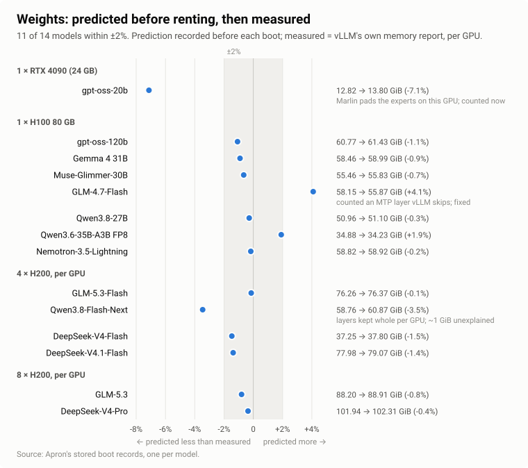
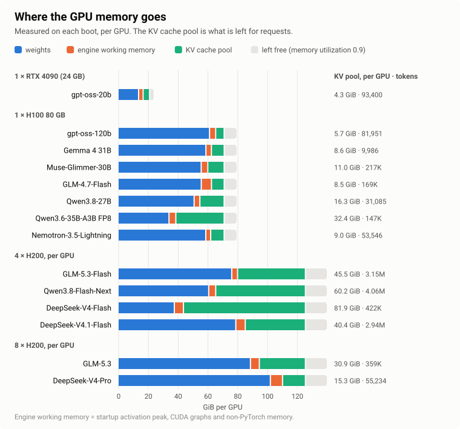
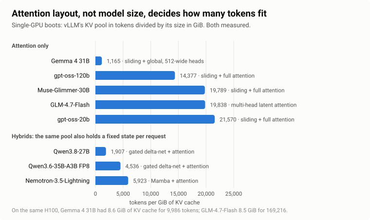
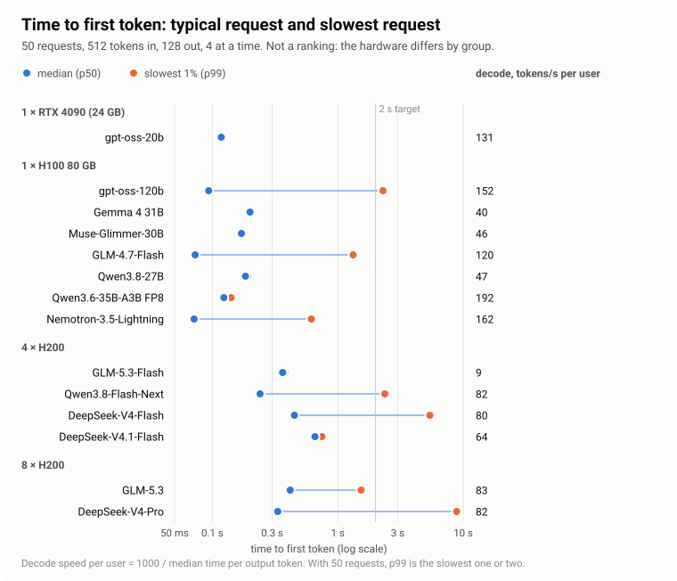

# I know you run models. Will it boot?

I know you run models. A new one comes out, everyone on your timeline is
running it, and you rent an H100 to try. Forty minutes later you still do not
know whether it fits on that card, and if it does, with what flags.

So I ran them: fourteen of the open models people run this month, from one RTX
4090 to eight H200s, and I kept every boot and every failure, so you do not
have to rent a GPU to find out.

This post is what I learned, and the tool that did it: Apron, an open-source
tool that answers "will it fit, will it boot, will it answer" before you rent
the GPU, then checks its own answer on a real one and keeps both. It is also
about what I got wrong along the way, and how I found out.

<!-- more -->

In short: before renting anything, Apron predicted each model's weight memory
from its config, its safetensors headers and the pinned vLLM release's own
source. For 11 of 14 models the prediction landed within 2% of what vLLM
measured on the GPU. The three misses are explained below, and two are fixed.
Four models broke on the way: two hybrids that vLLM's defaults could not boot
on an H100, one that booted and answered in the wrong channel, and one that
crashed on a tool call with CUDA graphs. Each fix was proven by a second boot.
A model that boots is not a model that answers, and a slow p99 here is usually
one or two slow requests. The sections below say which is which.

## Read this first: what this does not show

There is one measured boot per model. Fourteen models on four hardware setups,
most of them datacenter cards: one RTX 4090, seven single H100s, four models on
four H200s and two on eight. An earlier cohort of smaller models adds five GPU
types. That is evidence, not a statistic. Consumer cards are next.

The prompts are short. The single-GPU boots ran with `--max-model-len 640` and
the multi-GPU boots with 32,768. The serving test is 50 requests of 512 tokens
in and 128 out, four at a time. This shows whether a model boots and answers,
not how it performs at long context.

The task checks are correctness checks, not a benchmark. They show that the
endpoint answers; they say nothing about which model is better. Nothing here is
a ranking: the hardware differs from group to group.

Some of the startup-peak rule comes from observation (details below). The
four-GPU models whose startup peak and CUDA-graph estimate the calculator still
under-predicts (by up to 2.2 and 2.0 GiB) are kept apart until it explains
them.

As for the KV budget: with today's calculator, the predicted KV budget is
within the planner's safety buffer (plus a compile segment vLLM may hold) on
every single- and four-GPU record kept, and a test checks it. The buffer
(2.19 GiB) is the largest error measured on those records, not a tuned margin.
It was not always so at run time: gpt-oss-20b's KV cache came out 2.3 GiB
smaller than predicted, from the weight miss explained below.

The command-line tool is not ready for outside use yet. The records and the
rules are in the repository.

## The problem nobody owns

Deploying an open model on your own GPU is a three-way bet: the checkpoint, the
engine version and the hardware. Each of the three moves.

The engine moves every two weeks. vLLM v0.24 came out on June 29 and v0.30 on
September 22. Its maintainers are candid about how fast things change: they
turned down a hand-maintained table of model capabilities because such a table
"drifts", and kept reading capabilities from the code
([#52459](https://github.com/vllm-project/vllm/pull/52459)), and they now run
[nightly accuracy and performance checks](https://vllm.ai/blog/2026-07-16-keeping-vllm-production-quality)
on 17 model-and-hardware recipes on datacenter GPUs.

The models move about monthly, each with a new attention layout: Mamba and
gated delta-net hybrids, DeepSeek V4's compressed KV cache, GLM-5's linear plus
sparse attention. Each one pages memory differently. Ten of the last
twenty-five posts on the vLLM blog are about getting one particular model to
run well.

The hardware is consumer, professional and datacenter cards, rented by the
hour, with memory that is never quite the number on the box. An H100 80GB gives
PyTorch 85,017,493,504 bytes, not 85,899,345,920.

The tools around this are good and getting better. vLLM refuses many bad
configurations before loading and tells you what to change. NVIDIA's
aiconfigurator and llm-d's planner estimate memory and performance for common
attention types; aiconfigurator now lists hybrid models too. Hugging Face shows
whether GGUF and MLX files fit your hardware. None of them gives the joined
answer I kept needing: this exact checkpoint, on this exact vLLM version, on
this exact GPU, predicted before renting and then checked.

That need is on record. vLLM issue
[#29325](https://github.com/vllm-project/vllm/issues/29325) asked for a
preflight "dry run". In the discussion, a contributor from llm-d (IBM
Research) suggested building the planner in a separate repository, "so we can
move fast and quickly adapt to vLLM changes". The issue was closed as not
planned in July. The planners say it themselves:
aiconfigurator's README still notes that memory estimation "needs to be
studied more", and one of its issues
([#1396](https://github.com/ai-dynamo/aiconfigurator/issues/1396)) documents a
sweep that skipped the KV budget check, over-predicted throughput 4.6× and
recommended a configuration that did not deploy. Its maintainers have since
fixed the budget check, and their own diagnosis in that thread is the best
summary of the problem: the KV pool is "a small difference of two large
numbers", so a 1% error in the rest "is an ~18% error in admissible batch". I
don't say that to knock them: every estimate looks like this until it is
checked against a boot.

## What Apron does

Apron is a small loop with a strict rule about what it is allowed to call true.

1. Plan without a GPU. Read the checkpoint's config and safetensors headers
   from the Hub (headers only, no weights), and the facts of the pinned vLLM
   version: which architectures it registers, which tensors it loads and which
   it skips, how it pages KV cache for each layer type, its default batch
   sizes. Compute weights, KV cache per sequence, the startup activation peak
   and the CUDA graph cost per GPU.
2. Say "unknown" out loud. If a model uses an attention layout the calculator
   does not model, the answer is "unknown", not an estimate borrowed from a
   different layout.
3. Boot and measure. Rent the GPU, download the weights on the machine, boot
   the exact plan, read vLLM's own memory accounting, run a small set of checks
   and a serving test, shut the machine down.
4. Keep the prediction beside the measurement. Every record is
   content-addressed and stores what was predicted next to what was measured,
   with the engine image digest and the hardware it ran on.
5. Prove fixes. When a boot fails, the error is fingerprinted and matched to a
   correction rule. A rule starts as a *hypothesis*; it becomes a proven rule
   only when a second boot with the correction succeeds.

Every number Apron shows is labeled by how it is known: *derived* (computed
from inputs), *proven constraint* (the pinned engine's source enforces it),
*predicted* (the calculator modeled it) or *measured* (the exact execution
observed it). A prediction is never presented as a vLLM test.

## Predicted before renting, then measured

The chart at the top is the whole idea in one picture. Each dot is one model:
the weight memory Apron predicted before the GPU was rented, against what vLLM
reported after loading. The prediction is the one recorded before the boot,
not a number recomputed afterwards.

Eleven of fourteen are within 2%. Three are outside it.

gpt-oss-20b on the RTX 4090 came out 7.1% low. Below Hopper, vLLM runs
gpt-oss's MXFP4 experts on Marlin, which pads them from 2880 to 3072 × 2944.
Apron counts that padding now: 13.67 GiB predicted.

GLM-4.7-Flash came out 4.1% high. I counted a multi-token-prediction layer that
vLLM does not load. Without it the prediction is 55.77 GiB against 55.87
measured.

Qwen3.8-Flash-Next on four H200s came out 3.5% low. The boot showed layers vLLM
keeps whole on every GPU instead of splitting them. Apron counts them now
(59.82 GiB predicted), and about 1 GiB per GPU is still not explained.

## The models at a glance

I picked models by what people actually use and talk about in September 2026
(OpenRouter rankings, provider counts, Hacker News and r/LocalLLaMA threads),
not by download counts. The column most worth copying is the third: what each
model needed beyond vLLM's defaults to boot and answer on that hardware. The
longer notes for each model are at the end of the post.

| Model | Hardware · vLLM | Set beyond the defaults | Checks passed | KV pool, tokens | Cold start |
|---|---|---|---|---|---|
| gpt-oss-20b | 1 × RTX 4090 · v0.30 | nothing | 3/3 | 93,400 | 152 s |
| gpt-oss-120b | 1 × H100 · v0.29 | nothing | 3/3 | 81,951 | 227 s |
| Gemma 4 31B | 1 × H100 · v0.29 | nothing | 3/3 | 9,986 | 268 s |
| Muse-Glimmer-30B | 1 × H100 · v0.30 | `--reasoning-parser muse_glimmer` | 3/3 | 217,478 | 176 s |
| GLM-4.7-Flash | 1 × H100 · v0.29 | nothing | 3/3 | 169,216 | 104 s |
| Qwen3.8-27B | 1 × H100 · v0.30 | `--max-num-seqs 275` | 3/3 | 31,085 | 197 s |
| Qwen3.6-35B-A3B FP8 | 1 × H100 · v0.30 | nothing | 3/3 | 147,108 | 507 s |
| Nemotron-3.5-Lightning | 1 × H100 · v0.30 | `--max-num-seqs 556` | 3/3 | 53,546 | 135 s |
| GLM-5.3-Flash | 4 × H200 · v0.30 | `--enforce-eager` | 4/5 | 3.15M | 28 min |
| Qwen3.8-Flash-Next | 4 × H200 · v0.30 | 95 GiB of host RAM | 5/5 | 4.06M | 5.8 min |
| DeepSeek-V4-Flash | 4 × H200 · v0.30 | `--tokenizer-mode deepseek_v4` | 4/4 | 422,168 | 14.6 min |
| DeepSeek-V4.1-Flash | 4 × H200 · v0.30 | `--tokenizer-mode deepseek_v41`, 189 GiB of host RAM | 5/5 | 2.94M | 16.8 min |
| GLM-5.3 | 8 × H200 · v0.30 | nothing | 4/4 | 358,592 | 29 min |
| DeepSeek-V4-Pro | 8 × H200 · v0.30 | `--tokenizer-mode deepseek_v4` | 4/4 | 55,234 | 53 min |

A few notes on reading it. Single-GPU models answered three short questions.
Multi-GPU models ran five deployment checks: a 32k-token needle, a tool call,
JSON output, an image and reasoning. Text-only models skip the image check, so
their total is four. The multi-GPU rows also set tensor parallelism and the
model's reasoning and tool-call parsers, which the tool-call and reasoning
checks need. For models whose chat template reads `reasoning_effort` (gpt-oss,
GLM-5.x, DeepSeek V4), the checks send `reasoning_effort: low` in the request,
so a short answer fits the checks' small token budget. Cold start is the first
boot on a fresh machine, `torch.compile` included; a warm compile cache is
faster.

## Where the GPU memory goes

After the weights, vLLM takes what it needs to run (the startup activation
peak, CUDA graphs and memory outside PyTorch), leaves 10% of the card alone at
the default `--gpu-memory-utilization 0.9`, and gives everything else to the KV
cache. The green segment is the room left for your requests. On one H100 that
is between 5.7 and 32.4 GiB, and it is mostly what the weights leave: the
34 GiB Qwen3.6 FP8 leaves 32.4 GiB, the 61 GiB gpt-oss-120b leaves 5.7. How
many tokens fit in that room is a different question, and the next section
shows it depends on the attention layout.

## Attention layout, not model size, decides how many tokens fit

Gemma 4 31B and GLM-4.7-Flash had about the same KV memory on the same H100
(8.6 and 8.5 GiB). Gemma fits 9,986 tokens in it; GLM-4.7-Flash fits 169,216.
Gemma's global layers use 512-wide heads, so each token is expensive. GLM's
multi-head latent attention stores a compressed cache, so each token is cheap.
At long context Gemma 4 is KV-bound on one H100.

The hybrids are shown apart because their pool also holds a fixed state per
request (Mamba or gated delta-net), so their tokens per GiB are not comparable
with the others token for token. The number of concurrent long requests a pool
supports is roughly the pool divided by your context length, and less than
that for hybrids.

## Where the calculator was wrong: the startup peak

vLLM decides how much KV cache it can allocate by running one dummy batch at
startup and measuring the peak memory PyTorch allocated during it. Whatever
that peak is comes straight out of your KV budget. Apron predicts it, and until
this week its rule was simple and, on fifteen measured points from an earlier
cohort of smaller models on five GPU types, right to within 0.02 GiB: during
the first, cold compile, the compiler benchmarks the embedding kernel and
briefly allocates a copy of the embedding table plus two activation-sized
outputs.

The new models broke it in both directions:

| Model | Predicted | Measured |
|---|---|---|
| GLM-4.7-Flash | 0.65 GiB | 2.04 GiB |
| Gemma 4 31B | 2.79 GiB | 1.49 GiB |
| Qwen3.6-35B-A3B | 1.01 GiB | 1.92 GiB |
| Muse-Glimmer-30B | 2.71 GiB | 1.83 GiB |

That is not a rounding error. GLM-4.7-Flash's miss, 1.39 GiB, is about a sixth
of its 8.5 GiB KV pool: the room for requests the plan promised and vLLM did
not have.

Reading the source got me part of the way. For Gemma 4 it showed that a
multimodal model's dummy run feeds pre-built embeddings, so the embedding table
never enters the compiled graph. For GLM it found MLA's prefill scratch buffer
and the fused-MoE workspace. Both explanations still left about 0.4 GiB
unaccounted for, and I did not want to paper over 0.4 GiB with a constant.

So I measured it. I wrote a small `sitecustomize` hook that loads inside
`vllm serve`, wraps `profile_run`, turns on PyTorch's allocator history and
replays it to find the exact moment of the peak and every block alive at that
moment, with its allocation stack. One H100, the exact recorded serve commands,
a cold compile cache. It reproduced vLLM's logged peaks to the byte and named
every tensor.

In GLM-4.7-Flash the peak is MLA's prefill dummy (1,174,405,120 bytes,
allocated at `mla_attention.py:783`), the fused-MoE workspace (335,544,320),
and five query-width plus seven hidden-width buffers kept alive by the compiled
graph around attention.

Gemma 4 has no compile transient at all. Its peak is the forward pass: the
MLP's gate/up output, its activation, the attention output of a global layer
and two hidden states, plus a little left over from the video encoder. As a
control, I booted the same Gemma 4 with `--language-model-only`: 2,995,739,688
bytes measured against 2,994,733,056 predicted by the old rule. The old rule
was right; it applied to text-only models, and Gemma 4 is not one.

In Qwen3.6 and Muse-Glimmer (on vLLM v0.30) the peak is not in the language
model. It is the vision tower, encoding the dummy batch of images vLLM sizes
from the encoder budget: 65,536 patches for Qwen3.6, two 4,096-token images
for Muse-Glimmer, whose rotary embeddings are computed in FP32.

The rule is now the largest of four moments, each made of named tensors whose
shapes come from the config and the engine's defaults: the compile transient
(text-only models), the forward pass, the sampler, and the vision encoder's
profiling batch. Where a count of simultaneously live buffers comes from the
probe rather than from source, the code says so. All 30 measured points in the
records pass, the earlier ones included (27 within 6%); the four-GPU models
vLLM runs uncompiled are the exception, kept apart as above. Where a model's
vision tower has not been traced yet, the plan says "encoder peak not
modeled" instead of adding zero.

## New layouts, counted from the engine's own code

GLM-5.3-Flash and DeepSeek-V4.1-Flash, the two most-used open models on
OpenRouter in late September, do not load on vLLM v0.29, and both page KV cache in ways
that did not exist a quarter ago.

Before this week, Apron would have planned DeepSeek V4 as ordinary attention
and printed a confident number. That is the failure I care most about, so the
first fix was a guard: any config field describing an attention layout the
calculator does not read now makes the answer "unknown".

Then I taught it the layouts, from the v0.30 source.

In DeepSeek V4 and V4.1 the KV cache dtype is forced to an FP8 record of 584
bytes per state regardless of what you ask for; the cache is replicated on
every tensor-parallel rank rather than sharded; compressed, sliding-window and
indexer caches are grouped by a packed layout rather than the usual one. I ran
vLLM's own grouping functions verbatim on the traced specs and compared them
with Apron's calculator: 40 of 40 cases matched.

Qwen3.8-Flash-Next and GLM-5.3-Flash bring linear-attention state, compressed
index keys and ring buffers, again checked against vLLM's own code. Across the
four models, 136 cases, 0 mismatches.

Then there is host memory. DeepSeek V4.1 keeps 189 GiB of "Engram" tables and
Qwen3.8-Flash-Next 95 GiB of n-gram tables in pinned host RAM by default. A
GPU-only fit check would pass them on a machine that cannot hold them. Apron
now reports the host-RAM requirement with the plan.

All of these models are measured now, and their weights are in the chart at
the top. What the calculator still under-predicts for the four-GPU models is
the startup peak and vLLM's CUDA-graph estimate: those two rules were fitted on
compiled single-GPU models.

## When it broke anyway

vLLM's error messages are good; most of them already tell you what to change.
What they cannot tell you is whether you could have known before renting, and
whether the change works. That is the part Apron records.

| Model | What happened | Could it be known before renting? | Fix | Proven by a second boot |
|---|---|---|---|---|
| Nemotron-3.5-Lightning (v0.30) | `max_num_seqs (1024) exceeds available Mamba cache blocks (733)` | Yes: every decoding sequence needs one Mamba state block; the blocks follow from the KV budget | planner sets `max_num_seqs` from the predicted block count (556) | yes, 3/3 |
| Qwen3.8-27B (v0.29) | an opaque `aten::new_empty ... API call failed` inside FlashAttention | Yes: before measuring CUDA graphs, vLLM allocates a KV cache for 512 sequences; for this hybrid that is 24.5 GiB, more than was left | same planner rule (275) | yes, 3/3 (v0.30) |
| Muse-Glimmer-30B (v0.30) | booted, answered, scored 0/3 | Yes: its chat template has a reasoning channel and vLLM registers a parser for it | plan adds `--reasoning-parser muse_glimmer` when the template declares a reasoning channel | yes, 3/3 |
| GLM-5.3-Flash (v0.30) | "Input tensor addresses changed between capture and replay" on a tool call | No: a runtime check, at DEBUG only | `--enforce-eager` | yes, 4/5 deployment checks |

The second row is the interesting one. The real error was an out-of-memory in
the caching allocator, but the FlashAttention extension is built against an
older PyTorch stable ABI whose error macro drops the message. I found the
cause by reading the allocator and the extension source, and confirmed the
mechanism with a control: Qwen3.6, which takes the same kernel path with 35 GB
of headroom, booted fine.

The fourth row is the one I would have missed with default logging. With CUDA
graphs, GLM-5.3-Flash booted on four B200s, passed a 32k-token needle, then
died on the tool-call request. That check exists only when vLLM logs at DEBUG
(`compilation/breakable_cudagraph.py:419-424`), and it exists to stop a graph
from reading the wrong memory and answering wrong without a word. I kept DEBUG
on for exactly this. The same request failed the same way on H200s; eager mode
served it.

Every fix starts as a hypothesis rule in the repository, with the record that
motivated it. It is promoted only by the corrected boot.

I also broke my own harness twice, and both are now tests: a network volume
sized for one group of models filled up when the next group was added, and an
SSH read that waited for a command to finish before reading its output
deadlocked on a 12.7 MB vLLM log (the SSH window is 2 MiB). The second one cost
me a healthy boot's measurement.

The rented machines broke too, and a broken machine looks like a broken model:
a four-H200 host whose NVSwitch failed NCCL's first call, and four-H100 and
two-B200 hosts that failed the same way or never started at all. Apron now
tells a host fault from a model failure, retries (another machine, or NCCL's
NVLink SHARP off), and records neither as the model's. Weights now download on
the machine itself: a network volume attaches only to machines in its own
datacenter, and the GPUs kept appearing elsewhere.

## Time to first token: the typical request and the slowest one

Each model served the same 50 requests, four at a time. The blue dot is the
typical request; the orange one is the slowest 1%, which with 50 requests is
the slowest one or two. The number on the right is how fast one user sees
tokens arrive once the answer starts.

Most of the long lines are a few slow requests, not a slow model.
gpt-oss-120b answers its typical request in 0.09 s and its slowest in 2.3 s;
DeepSeek-V4-Pro in 0.33 s and 8.9 s. Judged by p99 alone against a 2-second
target, four models here "fail", and in each the median is under half a
second. These runs do not show why the slow requests were slow, so I am not
guessing.

One number I cannot explain yet: GLM-5.3-Flash on four H200s in eager mode
produced 9 tokens per second per user (111 ms per token), while GLM-5.3 on
eight H200s produced 83.

## Answers expire every two weeks

vLLM v0.30.0 came out on September 22; two of the models above do not load on
v0.29 at all. A flag, a default or a memory layout that was true last release
may not be true this one. Every record in this post says which vLLM version it
was measured on, and Apron's planner picks the newest pinned version that
registers a model's architecture.

## Where Apron fits

Apron reads vLLM's source, boots it, and keeps the record. It is not a serving
engine, a benchmark or a leaderboard. When aiconfigurator, llm-d or
vllm-project/recipes produce a plan or a verified config, Apron can take it as
a candidate and keep the prediction beside a measurement. When any of them
builds part of what Apron does, Apron calls their code and gets better.

## Apron needs YOU

The command-line tool is not ready for you to run on your own model yet; this
post is the evidence it has to earn first. Two things help now. Tell me which
model on which GPU to run next, especially consumer and workstation cards, in
[Discussions](https://github.com/mondegreens/apron/discussions). And if you
maintain a planner, an engine adapter or a recipe collection, the records are
for you to check against. The repository, the records and every rule are at
[github.com/mondegreens/apron](https://github.com/mondegreens/apron).

## Model notes

### gpt-oss-20b

OpenAI; MoE, MXFP4, alternating sliding and full attention; vLLM v0.30.

One RTX 4090 (24 GB), the consumer card. Weights were predicted at 12.82 GiB
and measured at 13.80 GiB: the Marlin padding above. Today's calculator
predicts 13.67 GiB. The KV pool is 4.3 GiB, 93,400 tokens, and the cold start
took 152 s. Time to first token is 0.12 s, typical and slowest; 131 tokens/s
per user. Checks 3/3.

### gpt-oss-120b

OpenAI; MoE, alternating sliding and full attention; vLLM v0.29.

One H100 80GB. Weights predicted 60.77 GiB, measured 61.43 GiB. The KV pool is
5.7 GiB, 81,951 tokens; cold start 227 s. Time to first token is 0.09 s
typical and 2.29 s slowest; 152 tokens/s per user. Checks 3/3.

### Gemma 4 31B

Google; dense, sliding plus global attention, vision; vLLM v0.29.

One H100. Weights predicted 58.46 GiB, measured 58.99 GiB. The KV pool is
8.6 GiB but only 9,986 tokens: its global layers use 512-wide heads, so each
token is expensive. At long context this model is KV-bound on one H100. Cold
start 268 s. Time to first token 0.20 s; 40 tokens/s per user. Checks 3/3.

### Muse-Glimmer-30B

Meta; dense, sliding plus full attention, vision; vLLM v0.30.

One H100. Weights predicted 55.46 GiB, measured 55.83 GiB. The KV pool is
11.0 GiB, 217,478 tokens; cold start 176 s. Time to first token is 0.17 s
typical and 0.18 s slowest; 46 tokens/s per user. Checks 3/3.

It needs `--reasoning-parser muse_glimmer`. Without it the first run scored
0/3 while every answer was right: the model replies in a reasoning channel and
an answer channel, and vLLM returned both as one string.

### GLM-4.7-Flash

Z.ai, previous generation; MoE, multi-head latent attention; vLLM v0.29.

One H100. Weights were predicted at 58.15 GiB before the boot and measured at
55.87 GiB; 55.77 GiB once I stopped counting the multi-token-prediction layer
vLLM does not load. The KV pool is 8.5 GiB, 169,216 tokens; MLA's compressed
cache is why so many tokens fit in so little memory. Cold start 104 s. Time to
first token is 0.07 s typical and 1.32 s slowest; 120 tokens/s per user.
Checks 3/3.

Its startup peak was my biggest miss (predicted 0.65 GiB, measured 2.04 GiB);
see the startup-peak section.

### Qwen3.8-27B

Alibaba; dense, gated delta-net hybrid, vision; failed on vLLM v0.29, booted on
v0.30.

One H100. On v0.29 it failed to boot: before measuring CUDA graphs vLLM
allocates a KV cache for 512 sequences, 24.5 GiB for this model, more than was
left; the out-of-memory surfaced as an opaque FlashAttention error.

It needs a lower `--max-num-seqs`. Apron picks 275, and with it the model
booted on v0.30: weights predicted 50.96 GiB, measured 51.10 GiB; KV pool
16.3 GiB, 31,085 tokens; cold start 197 s; time to first token 0.18 s;
47 tokens/s per user. Checks 3/3.

### Qwen3.6-35B-A3B FP8

Alibaba; MoE, gated delta-net linear attention plus full attention, vision;
vLLM v0.30.

One H100. Weights were predicted at 34.88 GiB before the boot and measured at
34.23 GiB (today's calculator: 34.09). The KV pool is 32.4 GiB, 147,108 tokens:
only one layer in four keeps a KV cache. Cold start took 507 s, the longest
single-GPU start here. Time to first token is 0.12 s typical and 0.14 s
slowest; 192 tokens/s per user. Checks 3/3.

Its startup memory peak is the vision encoder encoding a dummy batch of 65,536
image patches, not the language model.

### Nemotron-3.5-Lightning 30B

NVIDIA; MoE, Mamba plus attention; vLLM v0.30.

One H100. It failed to boot with vLLM's defaults: 1,024 concurrent sequences
need 1,024 Mamba state blocks and only 733 fit. It needs `--max-num-seqs` at or
below the block count. Apron picks 556 before renting, and with it the model
booted: weights predicted 58.82 GiB, measured 58.92 GiB; KV pool 9.0 GiB,
53,546 tokens; cold start 135 s; time to first token 0.07 s typical, 0.61 s
slowest; 162 tokens/s per user. Checks 3/3.

### GLM-5.3-Flash

Z.ai; the most-used open model on OpenRouter in September; MoE, sparse attention
plus linear attention, vision; vLLM v0.30 only.

Four H200s. Weights predicted 76.26 GiB per GPU, measured 76.37 GiB (the
checkpoint is 328 GB, downloaded on the machine in 6 minutes). The KV pool is
45.5 GiB per GPU, 3.15 million tokens.

The cold start took 28 min, most of it loading 328 GB from the machine's
network disk. Time to first token is 0.36 s typical and 0.38 s slowest;
9 tokens/s per user (111 ms per token), not explained yet. Deployment checks
4/5: the miss was my reasoning check's own effort setting, since fixed. It
needs `--enforce-eager`; see "When it broke anyway".

### Qwen3.8-Flash-Next

Alibaba; MoE, gated delta-net plus QSA attention, hyper-connections, vision;
vLLM v0.30 only.

Four H200s. Weights predicted 58.76 GiB per GPU, measured 60.87 GiB: layers
vLLM keeps whole on every GPU, counted now (59.82 GiB predicted), and about
1 GiB per GPU not explained yet. It also needs 95 GiB of pinned host RAM for
its n-gram tables. The KV pool is 60.2 GiB per GPU, 4.06 million tokens.

Cold start 5.8 min, after a 360 GB download on the machine (5.6 min). Time to
first token is 0.24 s typical and 2.37 s slowest; 82 tokens/s per user.
Deployment checks 5/5.

On two B200s vLLM had refused the plan: 1,024 sequences, 626 state blocks. On
four H200s the default fits with room (about 6,600 blocks predicted).

### DeepSeek-V4-Flash

DeepSeek, 0731; MoE, compressed and sliding-window attention, text only;
vLLM v0.30 only.

Four H200s. Weights predicted 37.25 GiB per GPU, measured 37.80 GiB. The KV
pool is 81.9 GiB per GPU, 422,168 tokens. Cold start 14.6 min, after a 167 GB
download (11.8 min). Time to first token is 0.45 s typical and 5.42 s slowest;
80 tokens/s per user. Deployment checks 4/4.

It needs vLLM's own `deepseek_v4` tokenizer mode. The checkpoint ships no chat
template; Apron's plan sets the mode.

### DeepSeek-V4.1-Flash

DeepSeek; the most-used open model on OpenRouter in the last week of September;
MoE with Engram
n-gram memory, vision; vLLM v0.30 only.

Four H200s. Weights predicted 77.98 GiB per GPU, measured 79.07 GiB. It also
needs 189 GiB of pinned host RAM for its Engram tables. The KV pool is 40.4 GiB
per GPU, 2.94 million tokens.

Cold start 16.8 min, after a 510 GB download (40.6 min, the slowest here).
Time to first token is 0.66 s typical and 0.75 s slowest; 64 tokens/s per
user. Deployment checks 5/5. It needs the `deepseek_v41` tokenizer mode, which
Apron's plan sets.

Before these three booted on H200s they had failed to start on B200 hosts that
never started a machine, under a boot limit I have since removed, and on a host
whose NVSwitch failed NCCL at startup. None of those was the model.

### GLM-5.3

Z.ai; MoE, sparse attention, text only; vLLM v0.30 only.

Eight H200s, on Modal (RunPod had no eight-H200 machines in stock). Weights
predicted 88.20 GiB per GPU, measured 88.91 GiB. The KV pool is 30.9 GiB per
GPU, 358,592 tokens.

Cold start 29 min. On an earlier hand-run boot, DeepGEMM's warm-up alone
compiled 2,335 kernels in about 11 minutes. Time to first token is 0.42 s
typical and 1.53 s slowest; 83 tokens/s per user. Deployment checks 4/4.

### DeepSeek-V4-Pro

DeepSeek, 0813; MoE, compressed and sliding-window attention, text only;
vLLM v0.30 only.

Eight H200s, on Modal. Weights predicted 101.94 GiB per GPU, measured
102.31 GiB. The KV pool is 15.3 GiB per GPU, 55,234 tokens: the biggest model
here leaves the least KV room of the multi-GPU boots.

Cold start 53 min, the longest here. Time to first token is 0.33 s typical and
8.86 s slowest; 82 tokens/s per user. Deployment checks 4/4. It needs the
`deepseek_v4` tokenizer mode, which Apron's plan sets.
